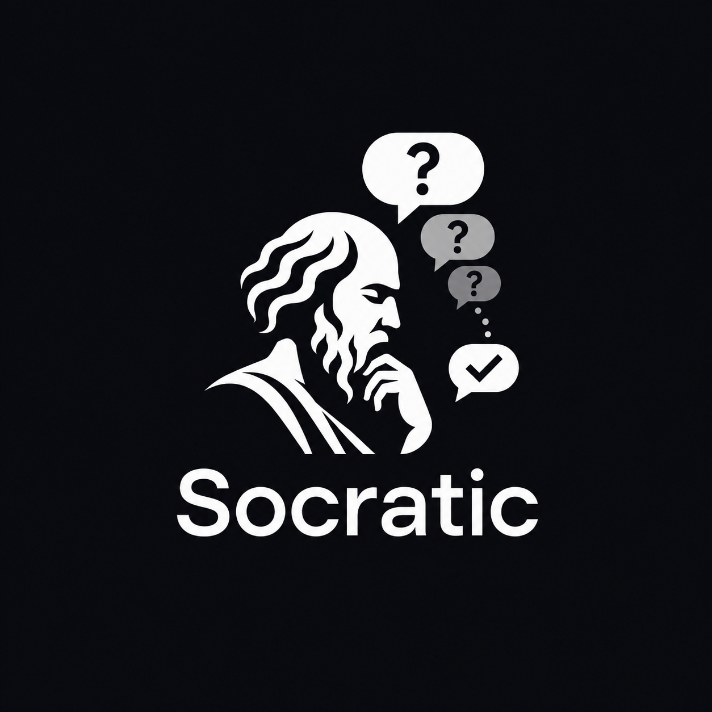

<p align="center">
  
</p>

<h1 align="center">Socratic</h1>

<p align="center">
  *Meta - questioning about questioning. Question yourself till you're left with only answers.*
</p>

**697 questions a senior engineer asks before writing code — packaged as a Claude/Codex skill and a portable prompt.**

## How it actually works

**The agent interviews itself, not you.** Point it at a task, and it silently works through the relevant slice of the question bank — reading the codebase where it can, applying sensible engineering defaults where it can't, and only stopping to ask you about the handful of decisions that are genuinely yours to make (budget, vendor, legal risk, an irreversible call). You see the outcome — a short "here's what I considered and assumed" summary — not 700 questions.

If you'd rather be interviewed live, ask for it ("interview me," "ask me one at a time") and it switches to a one-yes/no-question-per-turn mode instead. That's opt-in, not the default.

## What's in it

| Domain | Questions | File |
|---|---|---|
| Requirements & scope | 40 | [`questions/00-requirements.md`](questions/00-requirements.md) |
| Frontend & UI | 46 | [`questions/01-frontend.md`](questions/01-frontend.md) |
| Backend & services | 45 | [`questions/02-backend.md`](questions/02-backend.md) |
| Data & storage | 53 | [`questions/03-data.md`](questions/03-data.md) |
| API design | 48 | [`questions/04-api.md`](questions/04-api.md) |
| Security | 59 | [`questions/05-security.md`](questions/05-security.md) |
| Infrastructure & DevOps | 46 | [`questions/06-infra.md`](questions/06-infra.md) |
| Testing & quality | 38 | [`questions/07-testing.md`](questions/07-testing.md) |
| Observability & ops | 39 | [`questions/08-observability.md`](questions/08-observability.md) |
| AI / LLM / agents | 70 | [`questions/09-ai-llm.md`](questions/09-ai-llm.md) |
| Mobile & offline | 41 | [`questions/10-mobile.md`](questions/10-mobile.md) |
| Product & UX | 45 | [`questions/11-product-ux.md`](questions/11-product-ux.md) |
| Cost & performance | 42 | [`questions/12-cost-performance.md`](questions/12-cost-performance.md) |
| Compliance & legal | 42 | [`questions/13-compliance.md`](questions/13-compliance.md) |
| Team & maintenance | 43 | [`questions/14-team-maintenance.md`](questions/14-team-maintenance.md) |

Every file follows the same shape: **Priority 1** questions first, then thematic sections, then a **Verification** block to run *after* the build.

## Dynamic domain selection

The domain set isn't chosen once from the initial request — it's built by scanning for signals and can grow mid-build. Requirements and Testing are always in. Everything else gets pulled in when it matches:

| Signal | Domains added |
|---|---|
| UI, dashboard, form | Frontend |
| service, job, queue | Backend |
| database, schema, cache | Data |
| API, SDK, webhook, **connector**, integration | API |
| auth, payments, secrets, public-facing | Security |
| deploy, CI/CD, cloud, scaling | Infra |
| production, cron, monitoring | Observability |
| AI, LLM, agent, prompt, RAG | AI/LLM |
| mobile, iOS, Android, offline | Mobile |
| anything user-facing | Product/UX |
| scale, latency, high traffic | Cost/Performance |
| personal data, health, EU/CA users | Compliance |
| long-lived, team project | Team/Maintenance |

A "tool with connectors" isn't just an API question — it pulls in API (contract, third-party auth), Security (credential storage per connector, blast radius if one leaks), and Testing (mocking each connector's failure modes) together. If self-answering later reveals a new need — say, a persistent store you didn't expect — the scan re-runs and adds Data mid-task.

## Three ways to use it

### 1. As a Claude Code skill

```bash
mkdir -p ~/.claude/skills
cp -r socratic ~/.claude/skills/
```

### 2. As a Codex skill

Codex uses a different skill directory (`.agents/skills`, not `.claude/skills`):

```bash
mkdir -p ~/.agents/skills
cp -r socratic ~/.agents/skills/
```

Invoke explicitly with `$socratic`, or let it trigger implicitly when your request matches.

### 3. As a portable prompt

Paste [`PROMPT.md`](PROMPT.md) into the system prompt of any LLM — ChatGPT, Gemini, a local model, your own agent framework. Self-contained, no file dependencies.

## The self-interrogation loop

```
Scan request + codebase → build working domain set (dynamic, can grow mid-build)
   ↓
Self-answer every question: read codebase → apply engineering default → escalate only if it's a business decision
   ↓
Emit contract once: domains / highlights / assumed / open questions (0-3 ideally) / risks / plan
   ↓
Ask the (few) open questions, if any — batched
   ↓
Build
   ↓
Run Verification for every domain in the final set, including ones added mid-build
```

## Design principles

- **Self-answer by default.** The bank exists so the agent has more engineering perspective, not so the user fills out a form.
- **Read before assuming; assume before asking.** Escalation to the user is the last resort, reserved for decisions only they can authorize.
- **Domain set is dynamic.** It's built from signals in the request and code, and can grow as the agent learns more mid-task — not fixed at the first guess.
- **Testing runs every time.** Not gated behind the user asking for it — any tool/service/script that gets built gets its testing questions and verification pass.
- **Keep "Open questions" near zero.** A long list of open questions means engineering decisions got escalated that shouldn't have been.
- **Interactive mode is opt-in**, for when a user explicitly wants to be walked through it live.

## Extending it

Add a domain by dropping `questions/15-yourdomain.md` in, following the existing shape (Priority 1 → sections → Verification), then add a row to the signal table in `SKILL.md` and `PROMPT.md` so it gets picked up dynamically.

## License

MIT — see [LICENSE](LICENSE). Use it, fork it, ship it.

## Contributing

PRs welcome, especially:

- Domains not covered (embedded, games, blockchain, hardware, accessibility-in-depth)
- Questions that came from a real incident — those are the good ones
- Better signal words for dynamic domain detection
